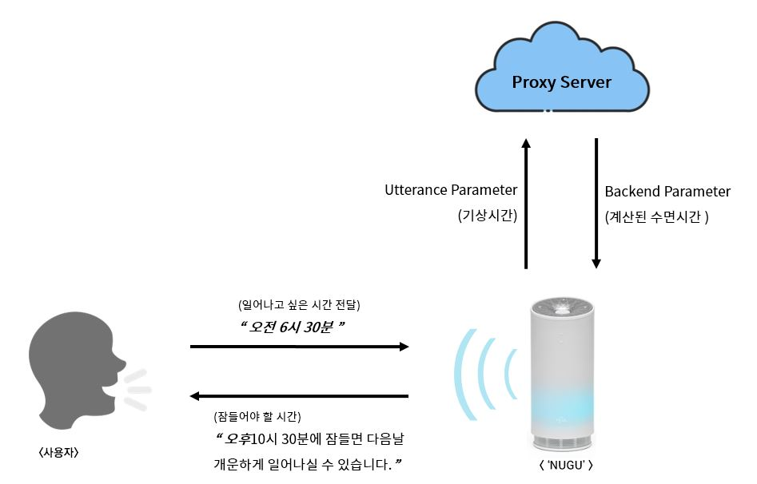
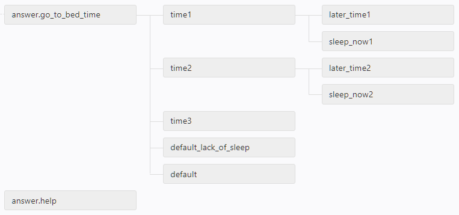
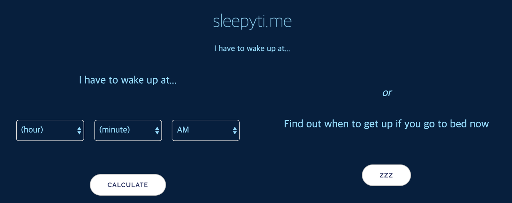
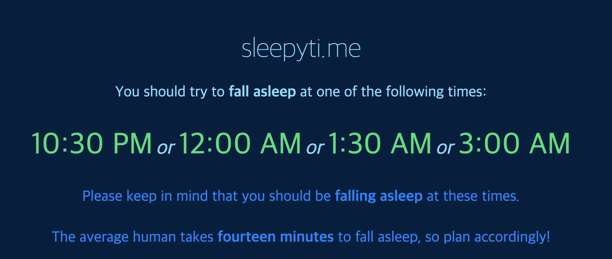
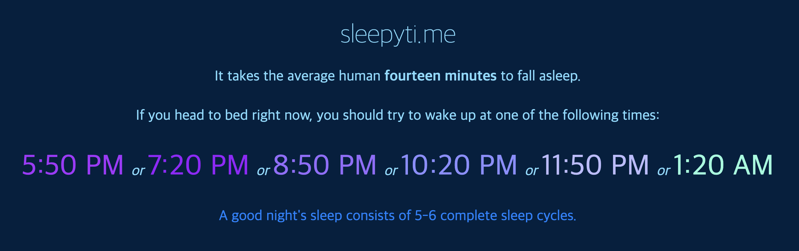
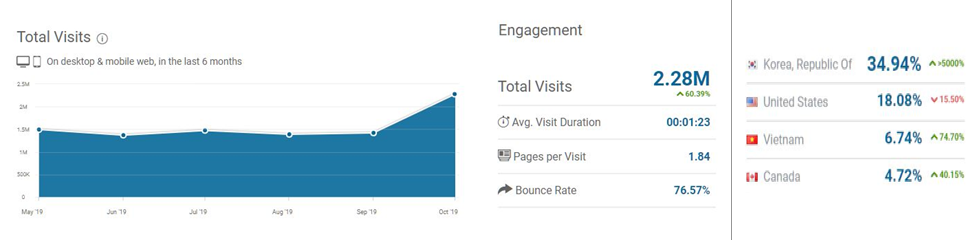

# SKT NUGU PLAY 푹 잔 느낌  
   
> **아침에 가장 상쾌하게 일어나기 위해서 몇 시에 자야 할까?**  
> 푹 잔 기분으로 일어나고 싶은 현대인을 위한 취침 시각 계산기

  
##### 팀 멤버
&nbsp;&nbsp;&nbsp;&nbsp;한양대학교 정보시스템학과 김지민, kimjiminhy@gmail.com  
&nbsp;&nbsp;&nbsp;&nbsp;한양대학교 정보시스템학과 박철우, thoutan@gmail.com  
&nbsp;&nbsp;&nbsp;&nbsp;한양대학교 정보시스템학과 변보선, eoqkr1217@hanyang.ac.kr    
&nbsp;&nbsp;&nbsp;&nbsp;한양대학교 정보시스템학과 장경희, gkdlfl1237@gmail.com  
&nbsp;&nbsp;&nbsp;&nbsp;한양대학교 정보시스템학과 황현주, dbsg0068@gmail.com  
  ㅤ
  ㅤ
  ㅤ
### 아이디어 및 배경 소개  
-----------------------------------------------
일찍 잤는데도 다음날 아침 알람을 듣는 것조차 힘들 때가 있습니다.
한편 새벽 늦게 잠들었는데도 아침에 상쾌하고 푹 잤다는 느낌을 받으며 깨기도 합니다.

*'많이 잤는데도 피곤하고, 적게 잤는데도 개운한 이유가 무엇일까?'*

푹 잔 느낌 프로젝트는 이러한 의문에서 시작 되었습니다.  
  
사람의 수면은 단순히 잠에 들고 깨는 과정이 아닙니다.
수면에는 총 5단계가 있습니다. 1단계부터 4단계를 비렘수면(Non-REM), 나머지를 렘수면(REM)이라고 합니다.  
  
* 수면의 1단계: 작은소리에도 금방 눈이 떠지고, 5분 후 2단계로 진입  
* 수면의 2단계: 두 개의 뇌파가 확인되고 10~15분 후 3단계로 진입  
* 수면의 3단계: 깊은 수면 진입 단계, 맥박과 호흡 등이 안정됨.  
* 수면의 4단계: 숙면의 단계, 잠을 깨기 어렵고 온 몸이 쉬는 단계.  
* REM수면 단계: 최고 숙면의 단계, 온몸의 근육이 풀어지고 긴장도가 최소화.
  

  
이렇듯 수면에는 여러 단계가 있기 때문에 우리가 어떤 단계일 때 일어나냐에 따라 기상 시의 기분이 달라집니다.
수면의 3, 4단계나 REM수면 단계일 때 기상 알람이 울려 잠에서 깨면, 숙면 중에 억지로 깬 것이라 극심한 피로감을 느낄 수 밖에 없습니다.
따라서 보다 개운하게 일어나려면 수면의 1,2단계에서 깨어나야 합니다.

원하는 기상 시각에 수면의 1,2 단계에 진입하려면 어떻게 해야할까요? 수면의 단계별 시간은 이미 과학적으로 확인된 바 있습니다. ([『Physiology, Sleep Stages Aakash K. Patel; John F. Araujo.』](https://www.ncbi.nlm.nih.gov/pubmed/30252388))
이에 따르면 수면의 5단계를 모두 거치기 위해서는 약 90분 정도의 시간이 필요합니다.
따라서 우리가 7, 8시간정도 잠을 자면 그동안 수면의 5단계가 대략 4, 5번정도 반복됩니다.
이를 역으로 계산하면 언제 자야 할 지 알 수 있습니다.

하지만 바쁜 현대인에게 몇시에 자야 할 지를 매번 계산하는 것은 매우 귀찮은 일입니다.
‘푹 잔 느낌’ 서비스는 이용자가 원하는 기상 시각을 입력하면 수면의 1, 2단계에서 깨어날 수 있는 취침 시각을 대신 계산해 줍니다.

계산된 취침 시각에 잠들면 수면의 1단계 혹은 2단계일 때 기상하므로, 피로감을 덜고 개운하게 일어날 수 있습니다.

‘푹 잔 느낌’ 서비스는 잠에 드는 시각이 불규칙하여 기상 시에 피로감을 느끼는 현대인들에게 개운한 아침을 선사합니다!  
  ㅤ
  ㅤ
  ㅤ
### 구성도 및 예상 발화
-----------------------------------------------
코드를 살펴보기에 앞서, '푹 잔 느낌'서비스의 구성도를 살펴볼까요?  
  
아래 그림은 첫 실행 발화(Ex. ‘아리아, 푹 잔 느낌 시작해줘’)를 통해 서비스에 진입한 후를 보여주는 구상도입니다.

예를 들어 사용자가 자신이 일어나고 싶은 ‘오전 6시 30분’을 NUGU에게 전달하면, NUGU는 ‘푹 잔 느낌’의 프록시 서버와 통신하여 사용자가 잠들어야 할 시각(앞으로 ‘취침 시각’이라고 지칭) 목록을 받아옵니다. 취침 시각은 발화가 시작된 시각(앞으로 ‘현재 시각’이라고 지칭)과 수면 시간을 모두 고려하여 계산합니다.
  

  
구성도가 이해되셨나요? 이어서 예상 발화를 통해 ‘푹 잔 느낌’이 제공하는 서비스를 좀 더 깊게 살펴보겠습니다.  

#### 기본 시나리오
  
  | | |  
  |----------|----------------|  
  | 사용자 | 아리아, 푹 잔 느낌 시작해줘 |  
  | NUGU | 안녕하세요, 푹 잔 느낌입니다. 몇 시에 일어나실 예정이세요? '오전 7시' 혹은 '오후 8시 30분' 처럼 말씀해 주세요. |  
  | 사용자 | (현재 시각이 오전 12시)오전 8시 30분에 일어날거야. |  
  | NUGU | 오전 12시 45분에, 주무시면 됩니다. 45분 남았습니다. 더 늦게 주무실 예정인가요? |  
  | 사용자 | 아니, 괜찮아 |  
  | NUGU | 푹 잔 느낌 서비스를 종료합니다. 안녕히 주무세요~ |  

가장 기본이 되는 발화 흐름입니다. ‘푹 잔 느낌’ 서비스는 사용자로부터 입력받은 기상 시각 ‘오전 8시 30분’에 대해 3개의 취침 시각을 계산합니다. 수면 사이클이 90분간 지속되므로, ’7시간 30분’, ‘6시간’ 그리고 ‘4시간 30분’이 수면의 1,2단계에 기상하기 위한 적절한 수면 시간입니다. 여기에 잠에 드는 시간인 약 15분 정도를 고려하여 취침 시각 목록은 ‘오전 12시 45분’, ‘오전 2시 15분’과 ‘오전 3시 45분’이 됩니다.

이 중에서 현재 시각과 가장 가까운 첫번째 시간과 그 시간까지 남은 시간을 알려줍니다. 혹시 더 늦게 취침하고 싶은 사용자를 위해 ‘더 늦게 주무실 예정인가요?’ 와 같은 추가질문도 제공합니다. 더 늦게 자고 싶은 분들을 위한 시나리오는 아래와 같습니다.
 
&nbsp;
 
  
#### 시나리오 2 (다른 시간이 궁금한 경우)
  
  | | |  
  |----------|----------------|  
  | 사용자 | 아리아, 푹 잔 느낌 시작해줘 |  
  | NUGU | 안녕하세요, 푹 잔 느낌입니다. 몇 시에 일어나실 예정이세요? '오전 7시' 혹은 '오후 8시 30분' 처럼 말씀해 주세요. |  
  | 사용자 | (현재 시각이 오전 12시)오전 8시 30분에 일어날거야. |  
  | NUGU | 오전 12시 45분에, 주무시면 됩니다. 45분 남았습니다. 더 늦게 주무실 예정인가요? |  
  | 사용자 | 응! |  
  | NUGU | 오전 2시 15분 혹은, 오전 3시 45분에 주무시면 됩니다. 안녕히 주무세요~ |  

현재 시나리오 2는 사용자에게 알려줄 수 있는 시간이 2개 이상일 경우 가능합니다. 만약 시각이 늦어 사용자에게 알려줄 수 있는 시간이 하나뿐일 경우에는 어떻게 될까요?  
 
&nbsp;
 
  
#### 시나리오 3 (알려줄 수 있는 시각이 1개인 경우)
  
  | | |  
  |----------|----------------|  
  | 사용자 | 아리아, 푹 잔 느낌 시작해줘 |  
  | NUGU | 안녕하세요, 푹 잔 느낌입니다. 몇 시에 일어나실 예정이세요? '오전 7시' 혹은 '오후 8시 30분' 처럼 말씀해 주세요. |  
  | 사용자 | (현재 시각이 오전 3시)오전 8시 30분에 일어날거야. |  
  | NUGU | 오전 3시 45분에 주무시면 됩니다. 45분 남았네요. 안녕히 주무세요~ |  
  
  
위의 예시처럼, 하나의 취침 시각을 알려주고 그 시각까지 남은 시간을 계산하여 알려줍니다. 그리고 취침 시각 목록에 더 남은 시각이 없기 때문에 ‘더 늦게 주무실 예정인가요?’ 등의 추가 질문 없이 서비스를 종료합니다.  
 
&nbsp;
 
  
#### 시나리오 4 (알려줄 수 있는 시각이 없는 경우)
  
  | | |  
  |----------|----------------|  
  | 사용자 | 아리아, 푹 잔 느낌 시작해줘 |  
  | NUGU | 안녕하세요, 푹 잔 느낌입니다. 몇 시에 일어나실 예정이세요? '오전 7시' 혹은 '오후 8시 30분' 처럼 말씀해 주세요. |  
  | 사용자 | (현재 시각이 오전 4시 30분)오전 8시 30분에 일어날거야. |  
  | NUGU | 수면 시간이 부족하니 지금 바로 주무시는 건 어떤가요? 다음부턴 꼭 4시간 30분 이상 주무시길 바라요. 푹 잔 느낌 서비스를 종료합니다. |  
  
‘푹 잔 느낌’ 서비스가 계산하는 최소 수면 시간은 4시간 30분입니다. 따라서 가능한 수면 시간이 4시간 30분 보다 적을 경우, 취침 시각을 계산해드리지 않습니다. 취침 시각을 알려줄 수 없기 때문에 4시간 30분 이상의 수면을 권장하는 멘트과 함께 서비스를 종료합니다.  
  ㅤ
  ㅤ
  ㅤ
### Play 구조 설명
-----------------------------------------------

 
&nbsp;
 
위의 이미지는 '푹 잔 느낌' Play 구조를 나타냅니다. Play 구조를 보고 나면 아래의 코드 설명을 이해하기 수월합니다.  
취침 시간은 플레이의 호출 시점과 사용자가 입력한 기상 시간 두가지를 통하여 계산됩니다.  
 

##### * time1
사용자가 입력한 기상 시간에 따라 3개의 반환 시간이 계산된 경우, time1이 실행되어 호출 시점과 가장 가까운 취침 시간을 알려주고 그 시각까지 얼마나 남았는지 알려주게 됩니다. 사용자가 더 많은 시간을 요구하게 되면, last_time1을 실행하여 계산된 2개의 시간을 더 알려주고 그렇지 않으면 sleep_now1이 호출되어 서비스를 종료하게 됩니다.
 
&nbsp;
  
##### * time2
입력된 기상 시간에 2개의 반환 시간이 계산된 경우, time2가 실행되어 호출 시점과 가장 가까운 취침시간을 알려주고 그 시각까지 얼마나 남았는지 알려줍니다. 사용자가 다른 시간을 더 요구하게 되면, last_time2를 실행하여 나머지 하나의 시간을 알려줍니다. 그렇지 않으면 sleep_now2가 호출되어 서비스가 종료됩니다.
 
&nbsp;
    
##### * time3
기상 시간에 따라 오직 1개의 반환 시간이 계산된 경우, 해당 시간만 알려준 후 서비스는 종료하게 됩니다.
 
&nbsp;
    
##### * default_lack_of_sleep
사용자가 입력한 기상 시간이 수면 시간 4시간 30분을 만족하지 못할 때 실행되는 함수입니다. '푹 잔 느낌' 서비스는 최소 4시간 30분 이상의 수면 시간을 권장합니다.  ㅤ
 
&nbsp;
     ㅤ
  
### 코드 설명
-----------------------------------------------
  
#### 1. 필요한 모듈  
~~~python
import pytz
import datetime
from flask import Flask, make_response
from flask_cors import CORS
from helper import request
import json
~~~  
##### * pytz
Olson 시간대 데이터베이스를 기준으로 한 세계 시간대 정의를 위한 라이브러리입니다. 'Asia/Seoul' 한국 시간대를 가져오기 위해서 사용였습니다.  
##### * datetime
시간 처리를 위한 라이브러리입니다. 위의 pytz를 통해 한국 시간대를 가져와 datetime 객체 내부의 timezone 속성을 바꿔주었습니다. 
 
&nbsp;
 
#### 2. time_calculate 함수  
go_to_bed_time 함수에서 내부 호출되는 함수입니다. 기상시간의 'hour'와 'min' 값을 전달받아 사용자에게 알려줄 시간 리스트(time_one, time_two, time_three)를 계산합니다. 서버의 시간의 UST로 설정이 되어있기 때문에, 시간 리스트 처리전에 pytz 라이브러리를 사용하여 한국 시간대로 변경해 줍니다.  
  
~~~python
def time_calculate(hour, min):

    input_time = datetime.datetime.now().astimezone(pytz.timezone('Asia/Seoul')).replace(hour=hour,minute=min,second=0,microsecond=0)
    kst_now = datetime.datetime.now().astimezone(pytz.timezone('Asia/Seoul'))
   
    # 예를 들어, 현재 시간이 오후 10시이면서, 입력 값이 오후 9시인 경우 다음날 오후 9시로 처리할 수 있도록 처리.
    if input_time.hour < kst_now.hour:
        input_time = input_time.replace(day=input_time.day+1)
    elif input_time.hour == kst_now.hour:
        if input_time.minute < kst_now.minute:
            input_time = input_time.replace(day=input_time.day+1)

    time_one = input_time - datetime.timedelta(minutes=465) # 기상 시간 7시간 45분 전
    time_two = input_time - datetime.timedelta(minutes=375) # 기상 시간 6시간 15분 전
    time_three = input_time - datetime.timedelta(minutes=285) # 기상 시간 4시간 45분 전

    return kst_now, time_one, time_two, time_three
~~~
 
&nbsp;
   
  
#### 3. go_to_bed_time 함수  
사용자의 기상 시간(예를 들어, 오전 7시 30분)을 전달 받아 가장 먼저 시작되는 함수입니다. 받아온 시간을 형식에 맞게 처리해준 뒤, time_caculate 함수를 호출하여 반환값을 통해 변수(kst_now, time_one, time_two, time_three)값을 설정해줍니다. 이 설정된 값들은 아래에 있는 time_one, time_two, time_three 세개의 response 함수들에 전달됩니다.  
~~~python
def go_to_bed_time():

    data = request.get_json(silent=True, force=True)['action'].get('parameters')
    wakeup_time_duration = data.get('wakeup_time_duration').get('value') # 오전/오후 구분 => '오전'
    wakeup_time_hour = data.get('wakeup_time_hour').get('value') # 기상 시간의 '시간' => '8시'
    wakeup_time_min = data.get('wakeup_time_min',dict()).get('value', '0') # 기상 시간의 '분' => '30분'

    wakeup_time_hour = int(wakeup_time_hour)
    wakeup_time_min = int(wakeup_time_min)

    if wakeup_time_duration == "오전":
        if wakeup_time_hour > 12: # 오전 13시라는 입력이 들어온 경우, Exception 처리
            return make_response({"resultCode": "exception_common",
                                "output": "exception_common"})
    else:
        if wakeup_time_hour < 12: # 오후 3시라는 입력이 들어온 경우, 15시로 변경.
            wakeup_time_hour += 12
    
    # time_calculate 함수를 호출하여 각 변수에 대입.
    kst_now, time_one, time_two, time_three = time_calculate(wakeup_time_hour, wakeup_time_min) 

    output_times = dict()
    
    # 현재 시간이 어느 곳에 위치하는지에 따라 best_sleep_time을 각각 설정해줍니다.
    if kst_now < time_one:
        output_times['best_sleep_time1'] = time_transform(time_one)
        output_times['best_sleep_time2'] = time_transform(time_two)
        output_times['best_sleep_time3'] = time_transform(time_three)
        output_times['remain_time'] = time_transform(time_one-kst_now)
    elif time_one < kst_now < time_two:
        output_times['best_sleep_time2'] = time_transform(time_two)
        output_times['best_sleep_time3'] = time_transform(time_three)
        output_times['remain_time'] = time_transform(time_two-kst_now)
    elif time_two < kst_now < time_three:
        output_times['best_sleep_time3'] = time_transform(time_three)
        output_times['remain_time'] = time_transform(time_three-kst_now)
    elif time_three < kst_now:
        output_times['default_lack_of_sleep'] = "True"

    # output 형태는 다음과 같습니다다.
    output = {
                "resultCode": "OK",
                "output": output_times
            }

    return make_response(output)
~~~  
 
&nbsp;
   
  
#### <u>* 다음 4 ~ 6은 RESTful API를 통해 Play builder에서 미리 정의한 Backend 파라미터로 값을 전달해주는 response 함수입니다.<u/>  
 
&nbsp;
   
  
#### 4. time_one 함수  
사용자의 '푹 잔 느낌' 서비스 호출 시점이 time_one, time_two, time_three 보다 이전일 때(3개의 반환값이 생길 때), 실행되는 함수입니다. 호출 시점과 가장 가까운 취침시간(best_sleep_time1)과 그 시간까지 남은 시간(remain_time)을 리턴합니다.

~~~python
def time_one():
    data = request.get_json(silent=True, force=True)['action'].get('parameters')

    output_times = dict()

    # 위의 go_to_bed_time에서 계산된 'best_sleep_time1'과 'remain_time' 결과값을 리턴합니다.
    output_times['best_sleep_time1'] = data['best_sleep_time1'].get('value')
    output_times['remaine_time'] = data['remain_time'].get('value')

    output = {
        "resultCode": "OK",
        "output": output_times
    }

    return make_response(output)
~~~
 
&nbsp;
   
  
#### 5. time_two 함수  
사용자의 '푹 잔 느낌' 서비스 호출 시간이 time_one을 지나고 time_two보다는 이전일 때(2개의 반환값이 생길 때), 실행되는 함수입니다. 호출 시점과 가까운 'best_sleep_time2', 즉 time_two와 그 시간까지 남은 시간을 반환합니다.
~~~python
def time_two():
    data = request.get_json(silent=True, force=True)['action'].get('parameters')

    output_times = dict()
    
    # 위의 go_to_bed_time에서 계산된 'best_sleep_time2'과 'remain_time' 결과값을 리턴합니다.
    output_times['best_sleep_time2'] = data['best_sleep_time2'].get('value')
    output_times['remain_time'] = data['remain_time'].get('value')

    output = {
        "resultCode": "OK",
        "output": output_times
    }

    return make_response(output)
~~~
 
&nbsp;
   
  
#### 6. time_three 함수  
사용자의 '푹 잔 느낌' 서비스 호출 시간이 time_two을 지나고 time_three보다는 이전일 때(1개의 반환값이 생길 때), 실행되는 함수입니다. 따라서, 'best_sleep_time3', 즉 time_three와 그 시간까지 남은 시간을 반환합니다. 호출 시간이 time_three까지 지난 경우는 수면 시간이 최소 수면 시간을 만족하지 못하기 때문에 취침 시간을 계산해주지 않습니다. 함수의 구성이 간단하기 때문에 따로 적지 않았습니다.

~~~python
def time_three():
    data = request.get_json(silent=True, force=True)['action'].get('parameters')

    output_times = dict()

    # 위의 go_to_bed_time에서 계산된 'best_sleep_time3'과 'remain_time' 결과값을 리턴합니다.
    output_times['best_sleep_time3'] = data['best_sleep_time3'].get('value')
    output_times['remain_time'] = data['remain_time'].get('value')

    output = {
        "resultCode": "OK",
        "output": output_times
    }

    return make_response(output)
~~~
 
&nbsp;
   
  
#### 7. later_time_one 함수  
사용자가 time_one의 결과값을 받고 나서, 다른 취침시간을 더 알고 싶은 경우(시나리오 2에서 '더 늦게 주무실 예정인가요?' 라는 NUGU의 물음에 긍정적인 대답이 돌아온 상황)에 호출되는 함수입니다. go_to_bed_time 함수에서 계산된 나머지 결과값인 time_two와 time_three를 반환한다고 생각하시면 됩니다. 
~~~python
def later_time_one():
    data = request.get_json(silent=True, force=True)['action'].get('parameters')

    output_times = dict()
    
    # 위의 go_to_bed_time에서 계산된 'best_sleep_time3'과 'best_sleep_time3' 결과값을 리턴합니다.
    output_times['best_sleep_time2'] = data['best_sleep_time2'].get('value')
    output_times['best_sleep_time3'] = data['best_sleep_time3'].get('value')

    output = {
        "resultCode": "OK",
        "output": output_times
    }

    return make_response(output)
~~~
 
&nbsp;
   
  
#### 8. later_time_two 함수  
사용자가 time_two의 결과값을 받고 나서, 다른 취침시간을 더 알고 싶은 경우에 호출되는 함수입니다. 남은 결과값은 time_three뿐이기 때문에 이 값만 반환한다고 생각하시면 됩니다. 
~~~python
def later_time_two():
    data = request.get_json(silent=True, force=True)['action'].get('parameters')

    output_times = dict()
    print(data)
    
    # 위의 go_to_bed_time에서 계산된 'best_sleep_time3' 결과값을 리턴합니다.
    output_times['best_sleep_time3'] = data['best_sleep_time3'].get('value')

    output = {
        "resultCode": "OK",
        "output": output_times
    }

    return make_response(output)
~~~
 
&nbsp;
   

### 관련 자료
--------------------------
#### 1. 취침 및 기상 시간 계산 사이트[(https://sleepyti.me/)](https://sleepyti.me/)
 
  
 
이 사이트는 사용자에게 수면에 관한 두가지 기능을 제공합니다.  
  &nbsp;  
첫째로, 취침 시간 계산입니다. 입력된 기상 시간에 따라 언제 잠을 자면 되는지 계산해줍니다.
아래와 같이, 총 4개의 시간을 알려주는데요. 일어나야 하는 시간 9시간 전, 7시간 30분 전, 6시간 전 그리고 4시간 30분 전의 시간을 알려줍니다. 
이 시간들은 잠에 드는데 소요되는 시간을 포함하고 있지 않기 때문에, 만약 자신이 잠에 드는데 대략 15분이 걸린다면 계산된 시간에서 15분 전에 잠에 들어야 합니다. 
 
&nbsp;
 

 
&nbsp;
 
두번째 기능은 기상시간 입니다. 바로 지금 잠에 들었을 때, 언제 일어나야 개운하게 일어날 수 있는지 알려줍니다.  
이 기능에서는 잠에 드는 시간이 대략 15분이라는 것을 포함하여 여러 기상시간을 알려주고 가장 개운하게 일어날 수 있는 것은 5 ~ 6 사이클의 수면을 도는 것이라고 말해줍니다.
 
&nbsp;
 

 
&nbsp;
 
비즈니스용 웹 분석 서비스를 제공하는 SimilarWeb [(https://www.similarweb.com/)](https://www.similarweb.com/) 를 통해 알아낸 Sleepyti.me 사이트의 트랙픽은 다음과 같습니다.  
2019년 10월 기준, 월간 총 방문자 수는 약 228만명 정도이며 지난 6개월간의 그래프를 보면 약 150만명정도의 안정적인 사용자층을 확보한 서비스라는 것을 알 수 있습니다. 또한, 주목할만한 점은 오른쪽 리스트입니다. 각 국가마다 Sleepyti.me를 얼마나 사용하는지 볼 수 있는데 그 중 한국 사용자의 비율이 가장 높다는 것을 볼 수 있습니다. 이를 통해, 현재 많은 사람들이 취침 및 수면시간에 관심이 높다는 것을 알 수 있습니다.
 
&nbsp;
 

 
&nbsp;
 
  
#### 2. 『Physiology, Sleep Stages Aakash K. Patel; John F. Araujo.』[(https://www.ncbi.nlm.nih.gov/pubmed/30252388)](https://www.ncbi.nlm.nih.gov/pubmed/30252388)  
  
수면 패턴 및 수면과 관련된 질병에 관한 연구자료입니다. 수면 패턴이 몇 단계로 구성되어 있는지, 각 단계가 구체적으로 어떤 단계인지 그리고 수면과 관련된 질병에 관한 내용을 다루고 있습니다.  
 
&nbsp;
 
  
#### 3. 아침에 일어난 직후는 왜 이렇게 피곤할까?[(https://www.youtube.com/watch?v=tn89hk2j2-o)](https://www.youtube.com/watch?v=tn89hk2j2-o) 
  
잠을 많이 잔 것 같음에도 불구하고 아침에 일어나는 게 왜 힘든지에 관해 쉽게 설명해주는 영상입니다. 2019년 12월 17일 기준 조회수 2,319,947회에 육박하며 많은 사람들이 이 영상의 제목에 공감하고 있음을 알 수 있습니다. 
  
  
 
&nbsp;
 
