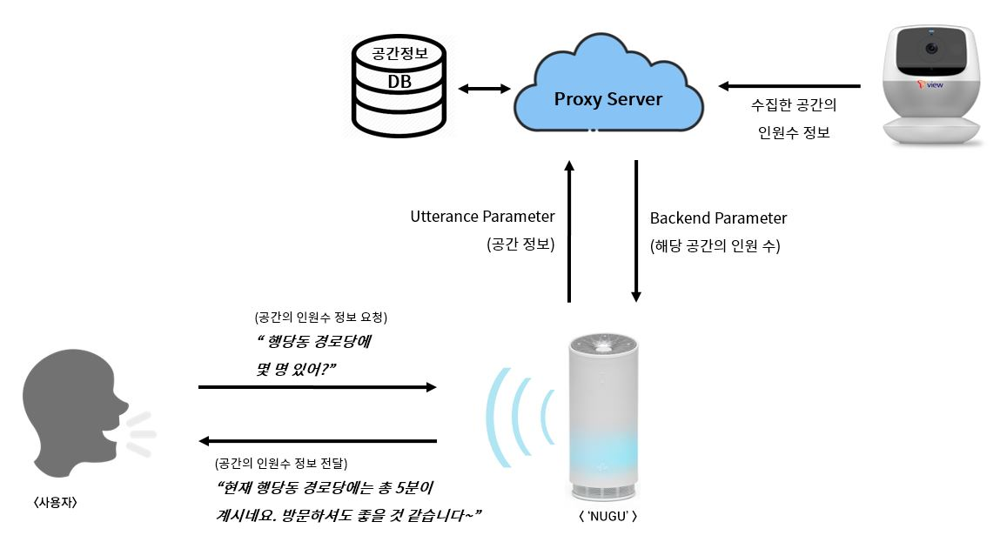

# SKT NUGU PLAY 경로당 친구들  
    
> **경로당에 가기 전에 미리 경로당에 몇 명이 있는지 알 수 없을까?**  
> 노인을 위한 실시간 경로당 인원 알리미 서비스  
  
##### 팀 멤버  
한양대학교 정보시스템학과 김지민, kimjiminhy@gmail.com  
한양대학교 정보시스템학과 박철우, thoutan@mail.com  
한양대학교 정보시스템학과 변보선, eoqkr1217@hanyang.ac.kr    
한양대학교 정보시스템학과 장경희, gkdlfl1237@gmail.com  
한양대학교 정보시스템학과 황현주, dbsg0068@gmail.com    
  ㅤ
  ㅤ
  ㅤ
### 아이디어 및 배경 소개  
-----------------------------------------------
할머니 할아버지들이 매일 하시는 경로당 눈치 게임! 무엇인지 감이 오시나요?  
바로 지금 경로당에 사람이 몇 명이 있는지, 즉, 현재 경로당에 있는 인원수입니다. 대부분은, 경로당에 사람이 한 명도 없다면 경로당에 가지 않는다고 합니다.  
왜냐하면 경로당에 도착했을 때 누군가 있어야 즐거운 시간을 보낼 수 있기 때문입니다. 그래서 할머니 할아버지들께서는 지금 경로당에 사람이 있는지 없는지, ‘눈치 게임’을 하고 계신 것입니다. 현재는 ‘전화’가 해결책으로 사용되고 있습니다. 경로당에 바로 전화를 걸어 사람이 있는지 확인을 하거나, 친구들에게 전화를 걸어 경로당에 있는지 확인을 하고 경로당으로 가는 것입니다.  
  
그래서, 저희들은 생각했습니다.  
  
‘지금 경로당에 몇 명이 있는지 알려드리면 일일이 전화할 필요가 없지 않을까?’ 
  ㅤ
  ㅤ
  ㅤ
### 기술 설명
-----------------------------------------------
##### * OpenCV & People Counting
설치한 카메라로부터 전송되는 영상을 실시간으로 분석해 People Counting기능을 구현하고, 해당 공간에 몇 명이 있는지 알려줍니다.  
Raspberry pi와 카메라 모듈, openCV를 활용해 People Counter(계수기)를 만들고 출입문에 설치합니다.  

> **공간에 들어온 인원 수 - 공간을 나간 인원 수 = 현재 공간에 있는 인원 수**  
     ㅤ
  ㅤ
  ㅤ 
##### * 구성도

