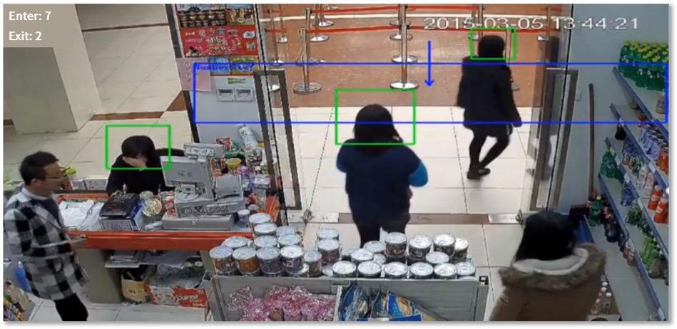
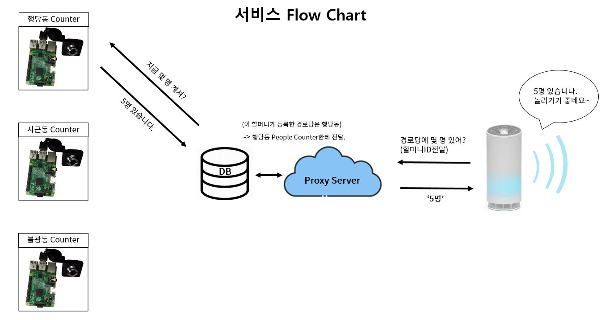

# SKT NUGU PLAY 경로당 친구들  
    
> **경로당에 가기 전에 미리 경로당에 몇 명이 있는지 알 수 없을까?**  
> 노인을 위한 실시간 경로당 인원 알리미 서비스  
  
##### 팀 멤버  
한양대학교 정보시스템학과 김지민, kimjiminhy@gmail.com  
한양대학교 정보시스템학과 박철우, thoutan@mail.com  
한양대학교 정보시스템학과 변보선, eoqkr1217@hanyang.ac.kr    
한양대학교 정보시스템학과 장경희, gkdlfl1237@gmail.com  
한양대학교 정보시스템학과 황현주, dbsg0068@gmail.com    
  ㅤ
  ㅤ
  ㅤ
### 아이디어 및 배경 소개  
-----------------------------------------------
할머니 할아버지들이 매일 하시는 경로당 눈치 게임! 무엇인지 감이 오시나요?  
바로 지금 경로당에 사람이 몇 명이 있는지, 즉, 현재 경로당에 있는 인원수입니다. 대부분은, 경로당에 사람이 한 명도 없다면 경로당에 가지 않는다고 합니다.  
왜냐하면 경로당에 도착했을 때 누군가 있어야 즐거운 시간을 보낼 수 있기 때문입니다. 그래서 할머니 할아버지들께서는 지금 경로당에 사람이 있는지 없는지, ‘눈치 게임’을 하고 계신 것입니다. 현재는 ‘전화’가 해결책으로 사용되고 있습니다. 경로당에 바로 전화를 걸어 사람이 있는지 확인을 하거나, 친구들에게 전화를 걸어 경로당에 있는지 확인을 하고 경로당으로 가는 것입니다.  
  
그래서, 저희들은 생각했습니다.  
  
‘지금 경로당에 몇 명이 있는지 알려드리면 일일이 전화할 필요가 없지 않을까?’ 
  ㅤ
  ㅤ
  ㅤ
### 기술 설명
-----------------------------------------------
##### * OpenCV & People Counting
설치한 카메라로부터 전송되는 영상을 실시간으로 분석해 People Counting기능을 구현하고, 해당 공간에 몇 명이 있는지 알려줍니다.  
라즈베리파이, 카메라 모듈과 openCV를 활용해 People Counter(계수기)를 만들고 출입문에 설치합니다.  
  

> **공간에 들어온 인원 수 - 공간을 나간 인원 수 = 현재 공간에 있는 인원 수**  

##### * 서비스 구성도 및 예상 발화  
아래 구성도를 통해, 서비스를 이해해볼까요? 사용자가 NUGU를 통해 경로당에 몇 명이 있는지 질문하게 되면 사용자의 ID가 '경로당 친구들'의 프록시 서버로 전달됩니다. 프록시 서버는 데이터베이스를 통해 사용자 ID에 등록된 경로당이 어디인지, 그리고 그 경로당에 설치되어 있는 라즈베리파이(People Counter)가 무엇인지 판단하게 됩니다. 그 후에 프록시 서버는 해당 People Counter에게 '사람이 몇 명 있니?'라는 요청을 전달하고 그에 따른 응답을 받아옵니다. 받아온 응답은 NUGU를 통해 사용자에게 전달됩니다.  
  

  
그럼 이제 여러 시나리오들을 통해, '경로당 친구들'서비스가 어떻게 작동할 수 있는지 살펴볼게요.
  
 #### 기본 시나리오  
 | | |
 |------------|---------------|
 | 사용자 | 아리아, 경로당 친구들 시작해줘 |
 | NUGU | 안녕하세요, 경로당 친구들입니다. 경로당에 친구 몇 분이 계신지 궁금하세요? '궁금해' 혹은 '아니'라고 말해주세요. |
 | 사용자 | 궁금해 |
 | NUGU | 현재 행당동 경로당에는 5분이 계세요. 놀러가셔도 좋을 것 같아요. 즐거운 시간 보내세요~ |
   
 기본 시나리오는 사용자의 발화를 최소화하는 방안으로 제작되었습니다. 자신의 경로당이 어디인지 혹은 경로당에 사람이 몇 명 있는지 등 긴 질문을 하지 않고, 서비스 실행 후 '궁금해' 라는 말만을 통해 듣고자 하는 결과를 얻을 수 있습니다. 사용자층의 나이를 고려하여 최대한 간편한 서비스를 제공하고자 했기 때문입니다. '경로당 서비스'를 좀 더 빠르게 이용하고자 하는 사용자들을 위해서 아래와 같은 시나리오도 제공됩니다.
 
  
#### 시나리오 2  
 | | |
 |------------|---------------|
 | 사용자 | 아리아, 경로당 친구들에서 친구 몇 명 있는지 알려줘 |
 | NUGU | 안녕하세요, 경로당 친구들입니다. 현재 행당동 경로당에는 5분이 계세요. 즐거운 시간 보내세요~ |

시나리오 1보다는 사용자의 발화가 길지만 더욱 빠르게 경로당의 인원을 파악할 수 있다는 장점이 있습니다.
위의 두 시나리오의 경우는, 사용자의 경로당 위치가 미리 설정이 되어있다고 가정합니다. 만일 설정이 안된 경우엔 어떻게 될까요?
  
  
#### 시나리오 3(경로당 설정이 안 된 경우)  
 | | |
 |------------|---------------|
 | 사용자 | 아리아, 경로당 친구들에서 친구 몇 명 있는지 알려줘 |
 | NUGU | 안녕하세요, 경로당 친구들입니다. 현재 어느 경로당을 이용하시는지 알 수 없어요. 어플리케이션을 실행하여 경로당 주소를 설정해주세요. |
   
 이처럼 경로당 위치를 설정해달라는 문구와 함께 서비스가 종료됩니다. 경로당의 위치가 '경로당 친구들' 어플리케이션을 통해 사전 등록 되어야 서비스 이용이 가능합니다. 
 
 

